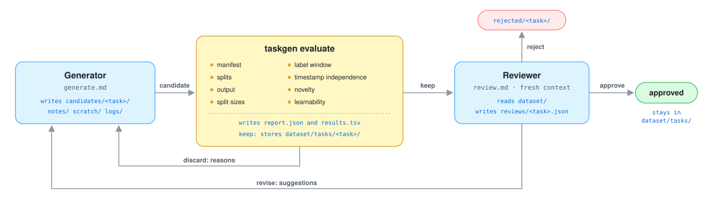

# Agentic task generation for relational databases

[](https://www.python.org)
[](https://github.com/stanford-star/relbench)
[](LICENSE)

LLM agents propose forecasting tasks for a relational database in
[RelBench 3](https://github.com/stanford-star/relbench) format. Each task is a RelBench task
manifest whose DuckDB SQL computes, at a timestamp t, a label per entity from the window
(t, t + timedelta]. A fixed harness validates each task; a separate agent reviews what the
harness keeps. Humans edit the instructions (`generate.md`, `review.md`); agents edit only their
workspace.

## Quick start

```console
$ pixi install
$ pixi run taskgen init rel-f1
```

Then start an agent (e.g. Claude Code) in this repository and prompt:

> Read generate.md and let's generate tasks for workspace rel-f1. Target: 2 approved tasks.

Approved tasks load like any RelBench task:

```python
import relbench

dataset = relbench.load_dataset("workspace/rel-f1/dataset")
task = dataset.load_task("driver-inactivity-180d")
train = task.get_table("train")
```

### Your own dataset

`init` takes a local folder in RelBench 3 layout (`manifest.yaml` + `db/*.parquet`) or any
Hugging Face dataset as `org/repo[/subdir]` (log in with `huggingface-cli login` for private repos):

```console
$ pixi run taskgen init /path/to/my-dataset --name mydb
$ pixi run taskgen init some-org/some-repo/my-dataset --name mydb --val 2020-01-01 --test 2021-01-01
```

`--name` defaults to the manifest's `name`; `--val`/`--test` are needed only if the manifest has
no cutoffs.

## How it works

<p align="center">
  
</p>

`taskgen evaluate` runs the checks in order and stops at the first that fails; each reason
starts with its check's name:

| check | rule |
|---|---|
| `manifest` | a forecast manifest (binary or regression) with the keys `generate.md` shows |
| `splits` | RelBench materializes train/val/test; at most `MAX_TRAIN_TIMESTAMPS` train timestamps |
| `output` | three columns, no NULLs, existing entities, one row per (timestamp, entity), valid labels |
| `split sizes` | enough rows and non-majority labels per split |
| `label window` | labels ignore rows after `timestamp + timedelta` |
| `timestamp independence` | a timestamp's rows don't depend on the other timestamps |
| `novelty` | not a near-duplicate of a kept task |
| `learnability` | RDBLearn + LightGBM beats constants and the entity's own label history on val + test |

The harness checks mechanics, not meaning, so a fresh reviewer agent then reads each kept
task, its labels and the database (never the generator's notes) and writes `approve`,
`revise` or `reject` to `reviews/<task>.json`. Only approved tasks count.

Thresholds are in `taskgen/config.py`. Each check is a class in `taskgen/checks/`; to add one,
subclass `Check` and list it in `taskgen/checks/__init__.py`.

## Layout

```diff
 .
 ├── generate.md               instructions for the agent that proposes tasks
 ├── review.md                 instructions for the agent that reviews them
 ├── taskgen/                  the harness (thresholds in config.py, one class per check in checks/)
 ├── tests/                    harness tests on a synthetic database
 └── workspace/<name>/         one per database, created by `taskgen init` (gitignored)
     ├── dataset/              a RelBench 3 dataset
     │   ├── manifest.yaml     tables, keys and the val/test cutoffs
     │   ├── db/               → the source tables (parquet)
+    │   │  ┏━━ generated tasks, in RelBench 3 format ━━━━━━━━━━━━━━━━━━━━━━━━━┓
+    │   └──╂─ tasks/<task>/                                                   ┃
+    │      ┃    ├── manifest.yaml              the task's SQL and fields      ┃
+    │      ┃    ├── {train,val,test}.parquet   its labels                     ┃
+    │      ┃    └── taskgen.json               the harness's report           ┃
+    │      ┗━━━━━━━━━━━━━━━━━━━━━━━━━━━━━━━━━━━━━━━━━━━━━━━━━━━━━━━━━━━━━━━━━━┛
     ├── candidates/<task>/    the generator's manifest.yaml, plus evaluate's report.json
     ├── reviews/<task>.json   the reviewer's verdict: approve, revise or reject
     ├── results.tsv           one row per evaluation
     └── notes/ scratch/ logs/ rejected/    the generator's working files
```

## Development

```console
$ pixi run test                  # run the tests
$ pixi run fmt                   # format with ruff
$ pixi run pre-commit install    # once per clone: run ruff on every commit
```

`pixi.toml` pins `relbench==3.0.1`, `fastdfs==1.1` and `rdblearn==1.1`, with an override for
rdblearn's `relbench==2.1.2` pin (only its unused `from_relbench` helper imports relbench).
Only `osx-arm64` is locked.

## License

[MIT](LICENSE), © 2026 stanford-star.
